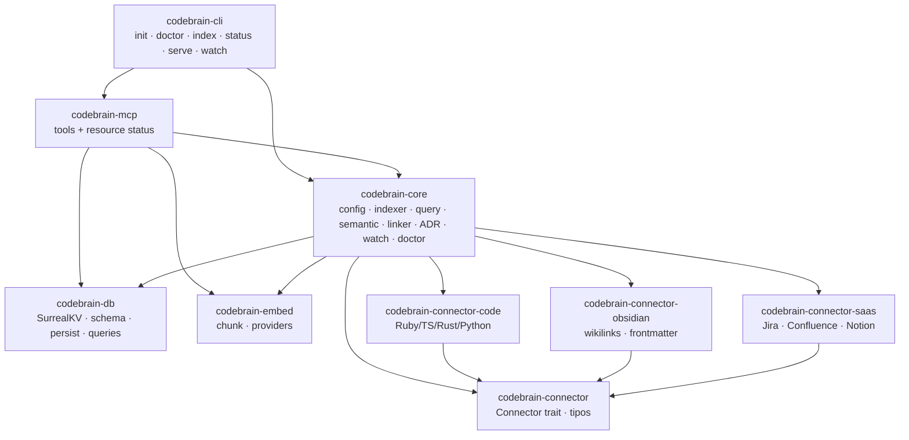
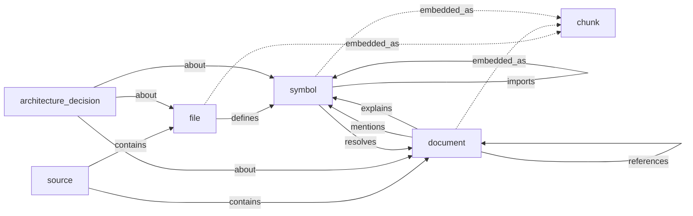
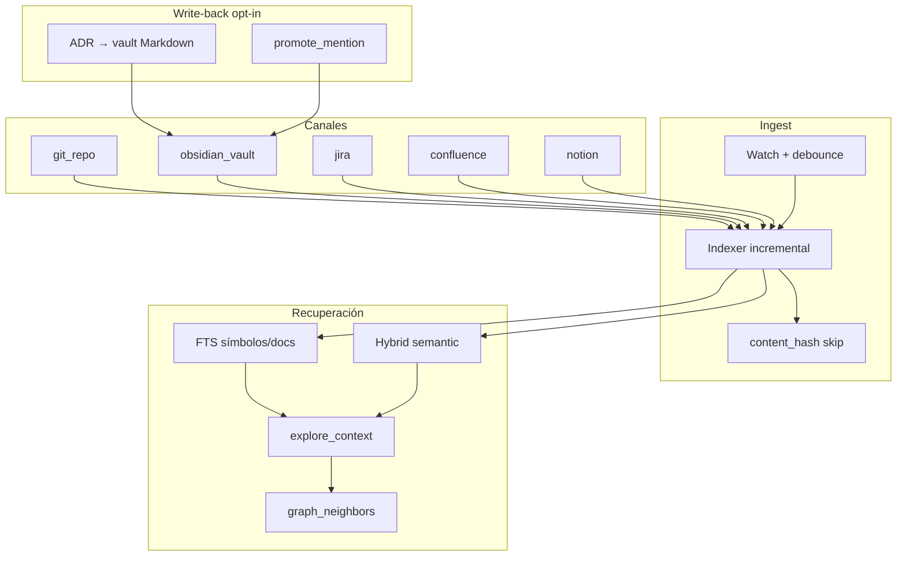

# CodeBrain — grafo de conocimiento del producto

Mapa de **crates**, **features**, **nodos/aristas** y **cómo se usa**.
Complementa el plan de fases (`PLAN-IMPLEMENTACION.md`) y los docs por conector.

## Cómo se usa (flujo mínimo)

```bash
# 1. Configurar fuentes (git / Obsidian / Jira / Confluence / Notion)
cp codebrain.example.toml codebrain.toml
# editar paths + exportar secretos (JIRA_*, NOTION_TOKEN)

# 2. Salud + schema
cargo build -p codebrain-cli --release
./target/release/codebrain --config ./codebrain.toml doctor --migrate

# 3. Indexar
./target/release/codebrain --config ./codebrain.toml index
./target/release/codebrain --config ./codebrain.toml status

# 4. Consultar desde el agente (MCP)
./target/release/codebrain --config ./codebrain.toml serve
# → conectar en Cursor/Claude (docs/MCP.md)
```

| Quieres… | Usa… |
|----------|------|
| Inventario de repos/vaults/SaaS | MCP `list_sources` (filtro opcional `source_kinds`) |
| Símbolo por nombre | `search_symbols` |
| Contexto omnicanal de un tema | `explore_context` |
| Pregunta en lenguaje natural | `semantic_search` |
| Expandir un nodo concreto | `graph_neighbors` con token `kind:source:key` |
| Registrar ADR | `add_architectural_decision` |
| Fortalecer mención nota→código | `promote_mention` |

Docs de instalación/seguridad/conectores: [`INSTALL`](./INSTALL.md) · [`MCP`](./MCP.md) · [`JIRA`](./JIRA.md) · [`CONFLUENCE`](./CONFLUENCE.md) · [`NOTION`](./NOTION.md) · [`BACKLOG`](./BACKLOG.md).

---

## Grafo de crates (workspace)



| Crate | Responsabilidad |
|-------|-----------------|
| `codebrain-cli` | Binario: ciclo de vida + `serve` / `watch` |
| `codebrain-mcp` | Superficie MCP (stdio o HTTP local) |
| `codebrain-core` | Orquestación: index, query, embeddings, linker, ADR |
| `codebrain-db` | Persistencia Surreal embebida + IDs estables |
| `codebrain-embed` | Chunking + providers (`none` / `fastembed` / OpenAI-compatible) |
| `codebrain-connector*` | Ingest: código, vault, SaaS |

---

## Grafo de dominio (nodos y aristas)



| Arista | De → A | Origen típico |
|--------|--------|----------------|
| `defines` | file → symbol | AST código |
| `calls` / `imports` | symbol → symbol | AST código |
| `references` | document → document | Wikilinks Obsidian; Confluence/Notion → ticket Jira |
| `mentions` | document → symbol | Linker por nombre/FQN (notas + wiki + Notion) |
| `explains` | document → symbol | `promote_mention` (o auto_promote) |
| `about` | ADR → symbol/file/document | Tool ADR |
| `resolves` | symbol → document (ticket) | Issue key en archivos de código |

Tokens MCP: `symbol:backend:Foo`, `document:tickets:MM-147`, `document:wiki:488079381`, `file:backend:app.rb`, `decision:system:Title`.

---

## Features ↔ módulos



| Feature (versión) | Dónde vive |
|-------------------|------------|
| Foundation / schema v1 | `codebrain-db`, `schemas/v1.surql` |
| Code graph | `connector-code` + `indexer` |
| Obsidian graph | `connector-obsidian` + linker mentions |
| MCP Brain | `codebrain-mcp` + `query` |
| GraphRAG | `embed` + `semantic` |
| Watch + ADR | `watch`, `adr` |
| GA (HTTP MCP, doctor, CI) | `cli`, docs, `.github` |
| SaaS Jira / Confluence / Notion | `connector-saas` + linkers `resolves` / cross-`references` |
| Filtro MCP `source_kinds` | `codebrain-mcp` + filtros en `query`/`semantic` | ✅ |

---

## Config mental model

```toml
[database]          # SurrealKV path
[sources.<name>]    # kind + path | jql/cql/query + max_issues + env auth
[embeddings]        # none | fastembed | openai_compatible
[index]             # batch_size, exclude, watch, debounce_ms
[linker]            # mention_threshold, auto_promote_explains
[mcp]               # stdio | http
[adr]               # write_vault, vault_source, directory
```

Secretos **nunca** en TOML: `JIRA_*`, `NOTION_TOKEN`.

---

## Agentes / calidad

Contrato: [`AGENTS.md`](../AGENTS.md) → `preflight` → implementar → `postcheck`.
Sin `Co-Authored-By` en commits. Backlog vivo: [`BACKLOG.md`](./BACKLOG.md).
